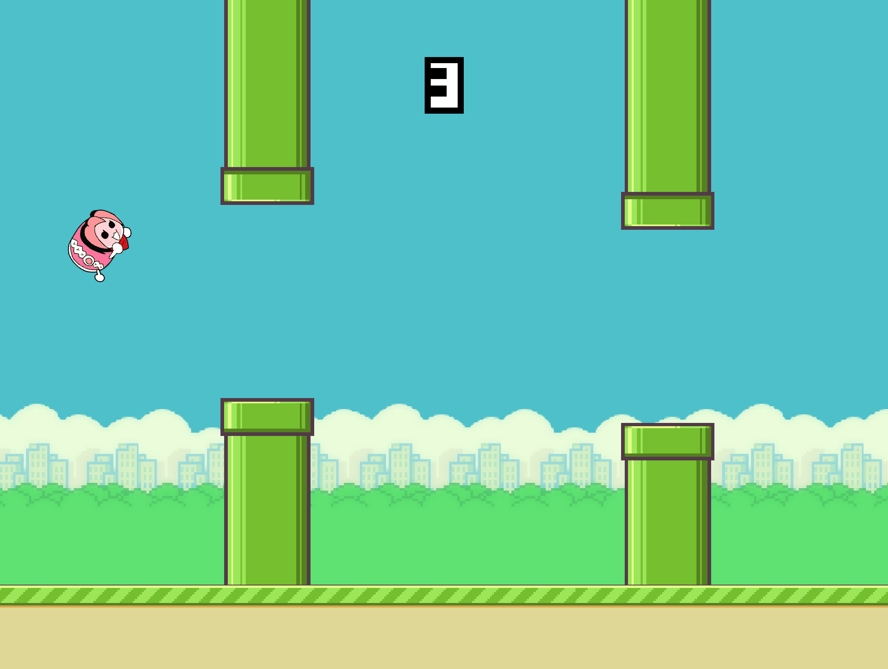

# Flappy Game Template

Heavily inspired by the mobile game [Flappy Bird](https://en.wikipedia.org/wiki/Flappy_Bird), this template shows how to create a complete game for both mobile and desktop for osu!framework.

## Usage

Open `FlappyDon.sln` in Visual Studio or Rider.

## Attributions

* Flappy Bird artwork by [Matthias Gall](https://github.com/digitalbreed/how-to-build-a-game-like-flappy-bird-with-xcode-and-sprite-kit).
* Number sprites by ahmadmanga, available on [opengameart.org](http://opengameart.org).
* Arcade font by [Jakob Fischer](https://www.pizzadude.dk).
* Remaining artwork + sounds are from [osu! resources](https://github.com/ppy/osu-resources).

